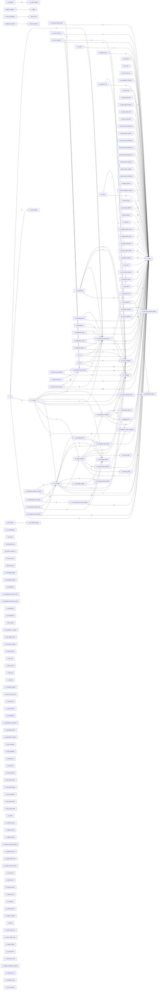

# Call graph (package level)

Generated by `make demo-f1` from `corpus/`. 150 package-to-package edges; edge labels are call-site counts.

```mermaid
flowchart LR
  n4["coe_utilities"] -->|2| n1["coe_dom_helper"]
  n9["logger_configure"] --> n8["logger"]
  n12["secure_employees"] --> n11["secure_dml"]
  n13["update_job_history"] --> n0["add_job_history"]
  n14["ut"] -->|3| n88["ut_expectation_processor"]
  n14["ut"] -->|4| n91["ut_file_mapper"]
  n14["ut"] -->|4| n131["ut_runner"]
  n14["ut"] -->|7| n155["ut_utils"]
  n19["ut_annotation_manager"] -->|11| n18["ut_annotation_cache_manager"]
  n19["ut_annotation_manager"] -->|2| n22["ut_annotation_parser"]
  n19["ut_annotation_manager"] -->|6| n80["ut_event_manager"]
  n19["ut_annotation_manager"] -->|6| n111["ut_metadata"]
  n19["ut_annotation_manager"] -->|2| n154["ut_trigger_check"]
  n19["ut_annotation_manager"] -->|15| n155["ut_utils"]
  n22["ut_annotation_parser"] --> n155["ut_utils"]
  n27["ut_be_false"] --> n155["ut_utils"]
  n35["ut_be_true"] --> n155["ut_utils"]
  n36["ut_be_within"] --> n37["ut_be_within_helper"]
  n38["ut_be_within_pct"] --> n155["ut_utils"]
  n39["ut_comparison_matcher"] --> n155["ut_utils"]
  n40["ut_compound_data_helper"] --> n88["ut_expectation_processor"]
  n40["ut_compound_data_helper"] -->|17| n155["ut_utils"]
  n41["ut_compound_data_value"] --> n40["ut_compound_data_helper"]
  n41["ut_compound_data_value"] -->|4| n155["ut_utils"]
  n42["ut_console_reporter_base"] -->|5| n24["ut_ansiconsole_helper"]
  n44["ut_coverage"] --> n45["ut_coverage_block"]
  n44["ut_coverage"] -->|4| n47["ut_coverage_helper"]
  n44["ut_coverage"] -->|2| n48["ut_coverage_helper_block"]
  n44["ut_coverage"] -->|4| n49["ut_coverage_helper_profiler"]
  n44["ut_coverage"] --> n52["ut_coverage_profiler"]
  n44["ut_coverage"] -->|6| n80["ut_event_manager"]
  n44["ut_coverage"] --> n111["ut_metadata"]
  n44["ut_coverage"] --> n146["ut_suite_manager"]
  n44["ut_coverage"] -->|7| n155["ut_utils"]
  n45["ut_coverage_block"] --> n47["ut_coverage_helper"]
  n45["ut_coverage_block"] --> n48["ut_coverage_helper_block"]
  n46["ut_coverage_cobertura_reporter"] -->|2| n44["ut_coverage"]
  n46["ut_coverage_cobertura_reporter"] -->|21| n155["ut_utils"]
  n48["ut_coverage_helper_block"] --> n155["ut_utils"]
  n50["ut_coverage_html_reporter"] -->|2| n44["ut_coverage"]
  n50["ut_coverage_html_reporter"] -->|2| n53["ut_coverage_report_html_helper"]
  n52["ut_coverage_profiler"] --> n47["ut_coverage_helper"]
  n52["ut_coverage_profiler"] --> n49["ut_coverage_helper_profiler"]
  n53["ut_coverage_report_html_helper"] --> n47["ut_coverage_helper"]
  n53["ut_coverage_report_html_helper"] -->|11| n155["ut_utils"]
  n54["ut_coverage_reporter_base"] -->|16| n44["ut_coverage"]
  n54["ut_coverage_reporter_base"] -->|2| n47["ut_coverage_helper"]
  n55["ut_coverage_sonar_reporter"] -->|2| n44["ut_coverage"]
  n55["ut_coverage_sonar_reporter"] -->|9| n155["ut_utils"]
  n56["ut_cursor_column"] -->|3| n40["ut_compound_data_helper"]
  n56["ut_cursor_column"] -->|2| n155["ut_utils"]
  n58["ut_cursor_details"] -->|3| n40["ut_compound_data_helper"]
  n58["ut_cursor_details"] -->|6| n111["ut_metadata"]
  n58["ut_cursor_details"] -->|4| n155["ut_utils"]
  n59["ut_data_value"] --> n155["ut_utils"]
  n60["ut_data_value_anydata"] --> n40["ut_compound_data_helper"]
  n60["ut_data_value_anydata"] -->|7| n111["ut_metadata"]
  n61["ut_data_value_blob"] --> n155["ut_utils"]
  n62["ut_data_value_boolean"] -->|3| n155["ut_utils"]
  n63["ut_data_value_clob"] --> n155["ut_utils"]
  n64["ut_data_value_date"] --> n155["ut_utils"]
  n65["ut_data_value_dsinterval"] --> n155["ut_utils"]
  n66["ut_data_value_json"] -->|4| n40["ut_compound_data_helper"]
  n66["ut_data_value_json"] -->|9| n155["ut_utils"]
  n67["ut_data_value_number"] --> n155["ut_utils"]
  n68["ut_data_value_refcursor"] -->|10| n40["ut_compound_data_helper"]
  n68["ut_data_value_refcursor"] -->|3| n88["ut_expectation_processor"]
  n68["ut_data_value_refcursor"] -->|19| n155["ut_utils"]
  n69["ut_data_value_timestamp"] --> n155["ut_utils"]
  n70["ut_data_value_timestamp_ltz"] --> n155["ut_utils"]
  n71["ut_data_value_timestamp_tz"] --> n155["ut_utils"]
  n72["ut_data_value_varchar2"] --> n155["ut_utils"]
  n73["ut_data_value_xmltype"] --> n155["ut_utils"]
  n74["ut_data_value_yminterval"] --> n155["ut_utils"]
  n75["ut_debug_reporter"] -->|3| n155["ut_utils"]
  n76["ut_documentation_reporter"] -->|5| n155["ut_utils"]
  n77["ut_equal"] -->|4| n88["ut_expectation_processor"]
  n77["ut_equal"] -->|2| n155["ut_utils"]
  n81["ut_executable"] -->|2| n80["ut_event_manager"]
  n81["ut_executable"] --> n88["ut_expectation_processor"]
  n81["ut_executable"] -->|3| n111["ut_metadata"]
  n81["ut_executable"] -->|4| n155["ut_utils"]
  n82["ut_executable_test"] --> n88["ut_expectation_processor"]
  n82["ut_executable_test"] --> n155["ut_utils"]
  n84["ut_expectation"] -->|8| n88["ut_expectation_processor"]
  n84["ut_expectation"] -->|2| n155["ut_utils"]
  n85["ut_expectation_base"] -->|2| n88["ut_expectation_processor"]
  n85["ut_expectation_base"] -->|2| n155["ut_utils"]
  n88["ut_expectation_processor"] --> n80["ut_event_manager"]
  n88["ut_expectation_processor"] --> n111["ut_metadata"]
  n88["ut_expectation_processor"] --> n132["ut_session_context"]
  n88["ut_expectation_processor"] -->|8| n155["ut_utils"]
  n89["ut_expectation_result"] --> n88["ut_expectation_processor"]
  n89["ut_expectation_result"] -->|4| n155["ut_utils"]
  n94["ut_have_count"] -->|2| n155["ut_utils"]
  n98["ut_json_tree_details"] -->|10| n155["ut_utils"]
  n99["ut_junit_reporter"] -->|37| n155["ut_utils"]
  n105["ut_logical_suite"] -->|6| n80["ut_event_manager"]
  n105["ut_logical_suite"] -->|2| n155["ut_utils"]
  n107["ut_matcher"] -->|5| n155["ut_utils"]
  n109["ut_matcher_options"] --> n88["ut_expectation_processor"]
  n109["ut_matcher_options"] -->|9| n155["ut_utils"]
  n110["ut_matcher_options_items"] -->|4| n155["ut_utils"]
  n111["ut_metadata"] --> n155["ut_utils"]
  n114["ut_output_buffer_base"] -->|3| n155["ut_utils"]
  n115["ut_output_bulk_buffer"] -->|4| n155["ut_utils"]
  n120["ut_output_table_buffer"] -->|5| n155["ut_utils"]
  n123["ut_realtime_reporter"] -->|13| n155["ut_utils"]
  n129["ut_run"] -->|2| n80["ut_event_manager"]
  n129["ut_run"] --> n88["ut_expectation_processor"]
  n129["ut_run"] --> n155["ut_utils"]
  n130["ut_run_info"] --> n155["ut_utils"]
  n131["ut_runner"] -->|2| n19["ut_annotation_manager"]
  n131["ut_runner"] --> n40["ut_compound_data_helper"]
  n131["ut_runner"] --> n42["ut_console_reporter_base"]
  n131["ut_runner"] -->|3| n44["ut_coverage"]
  n131["ut_runner"] --> n47["ut_coverage_helper"]
  n131["ut_runner"] -->|7| n80["ut_event_manager"]
  n131["ut_runner"] --> n88["ut_expectation_processor"]
  n131["ut_runner"] --> n111["ut_metadata"]
  n131["ut_runner"] -->|7| n146["ut_suite_manager"]
  n131["ut_runner"] -->|12| n155["ut_utils"]
  n132["ut_session_context"] --> n155["ut_utils"]
  n133["ut_session_info"] -->|31| n132["ut_session_context"]
  n133["ut_session_info"] -->|5| n155["ut_utils"]
  n134["ut_sonar_test_reporter"] -->|13| n155["ut_utils"]
  n136["ut_suite"] -->|2| n80["ut_event_manager"]
  n136["ut_suite"] -->|5| n155["ut_utils"]
  n137["ut_suite_builder"] -->|14| n155["ut_utils"]
  n138["ut_suite_cache_manager"] --> n18["ut_annotation_cache_manager"]
  n138["ut_suite_cache_manager"] --> n155["ut_utils"]
  n142["ut_suite_item"] -->|6| n155["ut_utils"]
  n143["ut_suite_item_info"] -->|2| n155["ut_utils"]
  n146["ut_suite_manager"] --> n19["ut_annotation_manager"]
  n146["ut_suite_manager"] -->|6| n80["ut_event_manager"]
  n146["ut_suite_manager"] -->|4| n111["ut_metadata"]
  n146["ut_suite_manager"] --> n137["ut_suite_builder"]
  n146["ut_suite_manager"] -->|12| n138["ut_suite_cache_manager"]
  n146["ut_suite_manager"] --> n147["ut_suite_tag_filter"]
  n146["ut_suite_manager"] -->|3| n155["ut_utils"]
  n147["ut_suite_tag_filter"] --> n155["ut_utils"]
  n148["ut_tap_reporter"] -->|2| n24["ut_ansiconsole_helper"]
  n148["ut_tap_reporter"] --> n155["ut_utils"]
  n149["ut_teamcity_reporter"] -->|10| n150["ut_teamcity_reporter_helper"]
  n149["ut_teamcity_reporter"] -->|8| n155["ut_utils"]
  n151["ut_test"] -->|6| n80["ut_event_manager"]
  n151["ut_test"] -->|5| n88["ut_expectation_processor"]
  n151["ut_test"] -->|17| n155["ut_utils"]
  n152["ut_tfs_junit_reporter"] -->|33| n155["ut_utils"]
  n154["ut_trigger_check"] --> n155["ut_utils"]
  n2["coe_namespaces"]
  n3["coe_tools"]
  n5["cust_address_typ"]
  n6["get_phone_number_f"]
  n7["insert_ord_line"]
  n10["phone_list_typ"]
  n15["ut_annotated_object"]
  n16["ut_annotated_objects"]
  n17["ut_annotation"]
  n20["ut_annotation_obj_cache_info"]
  n21["ut_annotation_objs_cache_info"]
  n23["ut_annotations"]
  n25["ut_be_between"]
  n26["ut_be_empty"]
  n28["ut_be_greater_or_equal"]
  n29["ut_be_greater_than"]
  n30["ut_be_less_or_equal"]
  n31["ut_be_less_than"]
  n32["ut_be_like"]
  n33["ut_be_not_null"]
  n34["ut_be_null"]
  n43["ut_contain"]
  n51["ut_coverage_options"]
  n57["ut_cursor_column_tab"]
  n78["ut_event_item"]
  n79["ut_event_listener"]
  n83["ut_executables"]
  n86["ut_expectation_compound"]
  n87["ut_expectation_json"]
  n90["ut_expectation_results"]
  n92["ut_file_mapping"]
  n93["ut_file_mappings"]
  n95["ut_integer_list"]
  n96["ut_json_leaf"]
  n97["ut_json_leaf_tab"]
  n100["ut_key_anyval_pair"]
  n101["ut_key_anyval_pairs"]
  n102["ut_key_anyvalues"]
  n103["ut_key_value_pair"]
  n104["ut_key_value_pairs"]
  n106["ut_match"]
  n108["ut_matcher_base"]
  n112["ut_object_name"]
  n113["ut_object_names"]
  n116["ut_output_clob_table_buffer"]
  n117["ut_output_data_row"]
  n118["ut_output_data_rows"]
  n119["ut_output_reporter_base"]
  n121["ut_path_item"]
  n122["ut_path_items"]
  n124["ut_reporter_base"]
  n125["ut_reporter_info"]
  n126["ut_reporters"]
  n127["ut_reporters_info"]
  n128["ut_results_counter"]
  n135["ut_stack"]
  n139["ut_suite_cache_row"]
  n140["ut_suite_cache_rows"]
  n141["ut_suite_context"]
  n144["ut_suite_items"]
  n145["ut_suite_items_info"]
  n153["ut_trigger_annotation_parsing"]
  n156["ut_varchar2_list"]
  n157["ut_varchar2_rows"]
  n158["ut_xunit_reporter"]
```
